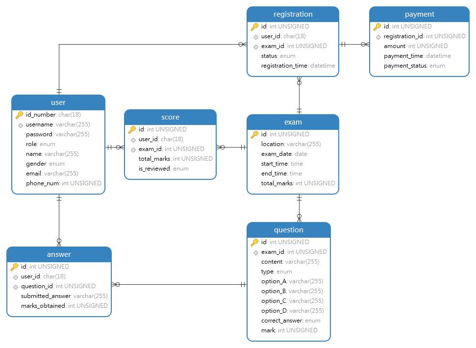

# 软件工程大作业：英语六级考试报考系统

## 1.数据库设计说明

Navicat模型图：

1.用户表（user）

- id_number（主键，身份证号）
- username（用户名，唯一）
- password（密码）
- role（用户角色，考生/教师/考试管理人员）
- name（姓名）
- gender（性别）
- email（电子邮箱）
- phone_num（手机号码）

2.考试表（exam）

- id（主键，自增长）
- location（考场地点）
- exam_date（考试日期）
- start_time（考试开始时间）
- end_time（考试结束时间）
- total_marks（总分值）

3.试题表（question）

- id（主键，自增长）
- exam_id（外键，关联exam表的id）
- content（题目内容）
- type（题目类型：选择题/翻译题/作文题）
- options_A/B/C/D（ABCD选项，适用于选择题）
- correct_answer（正确答案）
- marks（分值）

4.报名表（registration）

- id（主键，自增长）
- user_id（外键，关联user表的id）
- exam_id（外键，关联exam表的id）
- status（报名状态：待审核/已通过/未通过）
- registration_time（报名时间）

5.缴费表（payment）

- id（主键，自增长）
- registration_id（外键，关联registration表的id）
- amount（缴费金额）
- payment_time（缴费时间）
- payment_status（缴费状态：已缴费/未缴费）

6.答题表（answer）

- id（主键，自增长）
- user_id（外键，关联user表的id）
- question_id（外键，关联question表的id）
- submitted_answer（提交的答案）
- marks_obtained（得分）

7.成绩表（score）

- id（主键，自增长）
- user_id（外键，关联user表的id）
- exam_id（外键，关联exam表的id）
- total_marks（总分数）
- is_reviewed（是否已评阅）