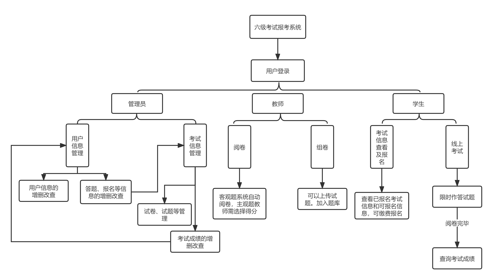
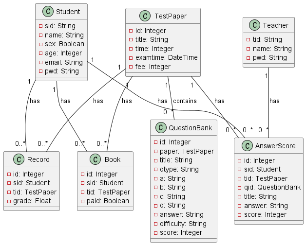
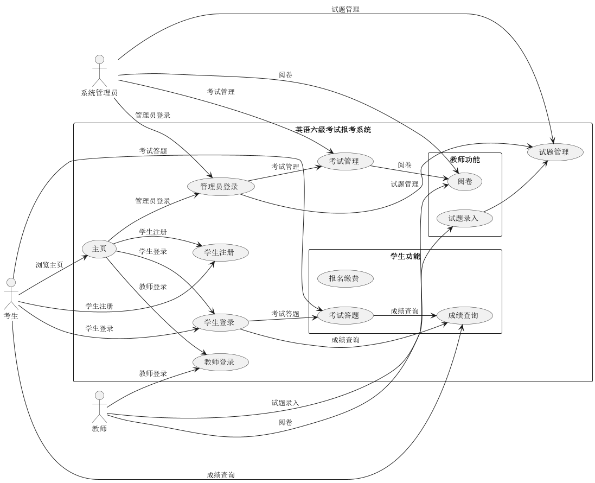

# 软件工程大作业：英语六级考试报考系统

## 1.需求分析

系统业务流程图如下：

## 2.数据库设计说明

数据库类图：

数据字典：

**学生表 (_Student_)**
- **sid** (_学号_) [Primary Key]: 字符串，长度为12，表示学生的学号
- **pwd** (_密码_): 字符串，长度为20，表示学生的密码

**教师表 (_Teacher_)**
- **tid** (_职工号_) [Primary Key]: 字符串，长度为12，表示教师的职工号
- **name** (_姓名_): 字符串，长度为20，表示教师的姓名
- **pwd** (_密码_): 字符串，长度为20，表示教师的密码

**试卷表 (_TestPaper_)**
- **id** (_序号_) [Primary Key]: 自增整数，表示试卷的序号
- **title** (_名称_): 字符串，长度为40，表示试卷的名称
- **time** (_考试时长_): 整数，表示考试的时长（单位为分钟）
- **examtime** (_考试时间_): 日期时间，表示考试的具体时间
- **fee** (_费用_): 整数，表示考试的费用，可以为null

**题目表 (_QuestionBank_)**
- **id** (_序号_) [Primary Key]: 自增整数，表示题目的序号
- **paper** (_试卷_): 外键，关联到试卷表的id字段，表示题目所属的试卷
- **title** (_题目_): 文本，表示题目的具体内容
- **qtype** (_题目类型_): 字符串，长度为40，表示题目的类型，可选值为"单选"或"主观"
- **a** (_A选项_): 字符串，长度为40，表示单选题的选项A
- **b** (_B选项_): 字符串，长度为40，表示单选题的选项B
- **c** (_C选项_): 字符串，长度为40，表示单选题的选项C
- **d** (_D选项_): 字符串，长度为40，表示单选题的选项D
- **answer** (_正确答案_): 文本，表示题目的正确答案
- **difficulty** (_难度_): 字符串，长度为10，表示题目的难度，可选值为"easy"、"middle"或"difficult"
- **score** (_分值_): 整数，表示题目的分值

**考试预订表 (_Book_)**
- **id** (_序号_) [Primary Key]: 自增整数，表示预订信息的序号
- **sid** (_学号_): 外键，关联到学生表的sid字段，表示预订考试的学生学号
- **tid** (_序号_): 外键，关联到试卷表的id字段，表示预订考试的试卷序号
- **paid** (_是否付款_): 布尔值，表示是否已付款，可选值为0（否）或1（是）

**答题记录和评分表 (_Answer_Score_)**
- **id** (_序号_)

[Primary Key]: 自增整数，表示答题记录和评分的序号
- **sid** (_学生_): 外键，关联到学生表的sid字段，表示学生的学号
- **tid** (_试卷_): 外键，关联到试卷表的id字段，表示答题的试卷序号
- **qid** (_题目_): 外键，关联到题目表的id字段，表示答题的题目序号
- **title** (_题目_): 文本，表示答题的题目内容
- **answer** (_答案_): 文本，表示学生的答案
- **score** (_得分_): 整数，表示题目的得分，默认为1000（注意：该字段有可能为None）

**学生成绩表 (_Record_)**
- **id** (_序号_) [Primary Key]: 自增整数，表示学生成绩的序号
- **sid** (_学号_): 外键，关联到学生表的sid字段，表示学生成绩的学生学号
- **tid** (_考试_): 外键，关联到试卷表的id字段，表示学生成绩的考试序号
- **grade** (_成绩_): 浮点数，表示学生的成绩

## 3. 用例图

